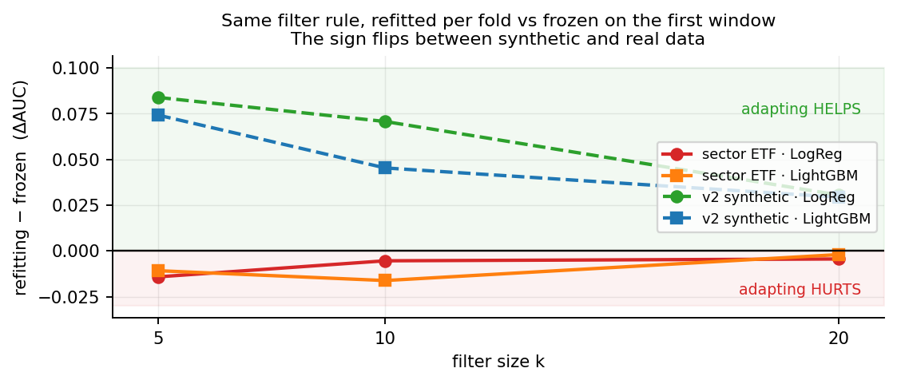
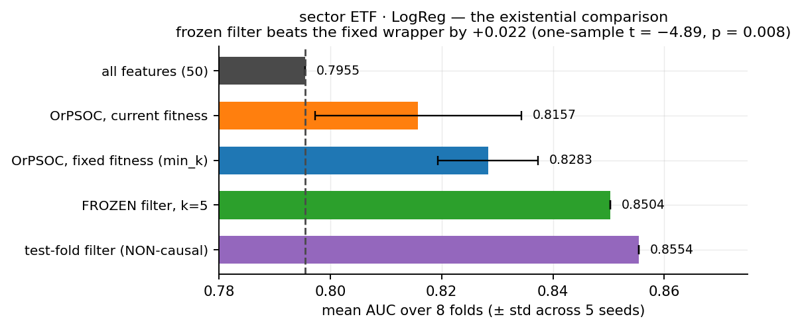
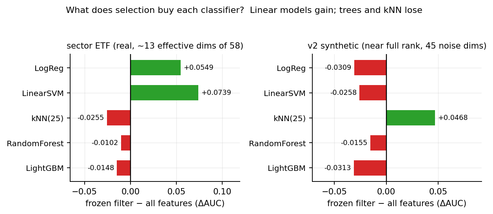
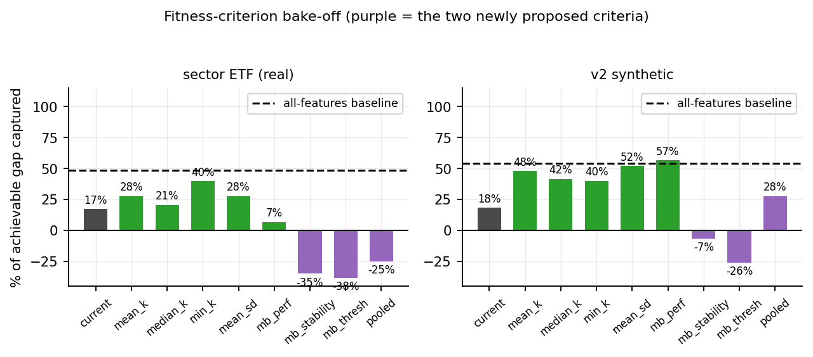
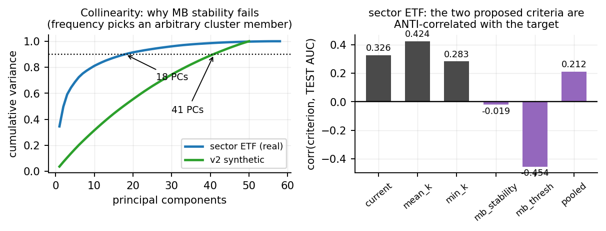
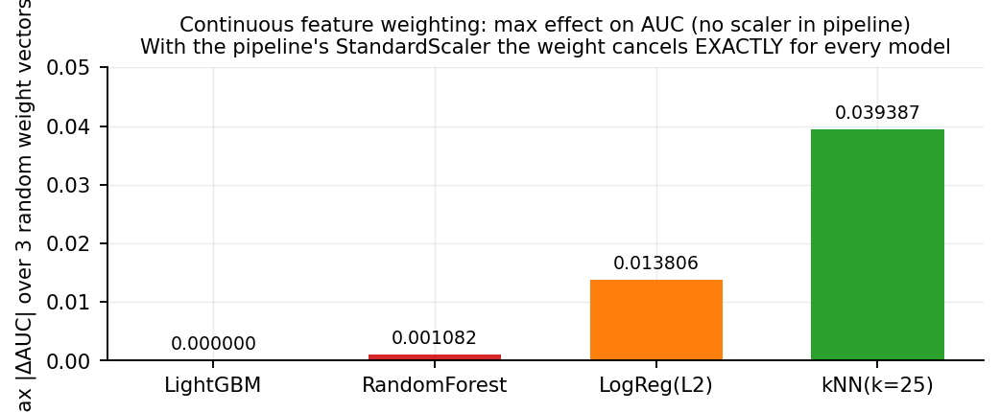

# Phase 3 & 4 — Supporting Results

Supplement to the update email. Every number was produced by running the current
codebase; nothing is quoted from an earlier generation.

**Sample sizes, stated up front.** Phase 3 uses 5 seeds; at n=5 the minimum
attainable two-sided Wilcoxon *p* is 0.0625, so the significance tests below are
one-sample t-tests against a deterministic comparator. Phase 4 is one run per
cell — the filter and baseline arms are deterministic, so they have no seed
variance to report. Two datasets throughout. These are strong directional
results, not a 30-seed protocol.

---

## 1. Adaptation hurts on real data

Same filter rule, same k, one refitted on every fold's training window and one
frozen on the first window and never updated.

{width=full}

| | k=5 | k=10 | k=20 | frozen wins |
|---|---|---|---|---|
| sector ETF · LogReg | −0.0141 | −0.0054 | −0.0044 | 3/3 |
| sector ETF · LightGBM | −0.0108 | −0.0162 | −0.0020 | 3/3 |
| v2 synthetic · LogReg | +0.0839 | +0.0708 | +0.0306 | 0/3 |
| v2 synthetic · LightGBM | +0.0742 | +0.0454 | +0.0294 | 0/3 |

The sign flips cleanly, 6/6 real cells against 6/6 synthetic cells.

**Mechanism.** The synthetic benchmark *defines* regime shift as the informative
feature set rotating: `s0–s2` are predictive only before the switch and `s3–s4`
only after (measured on v2 — pre-switch AUC(s0–s2)=0.938 vs AUC(s3–s4)=0.514;
post-switch 0.545 vs 0.943). Adaptation is therefore rewarded by construction.
Real financial regime shift moves the distribution without changing *which*
features are informative — sector volatility and momentum stay informative
through 2008 and 2020 — so re-ranking each fold chases sampling noise in the
most recent window and discards a stable, correct answer.

**Caveat for framing.** One real dataset supports this. Before it headlines the
paper it should be reproduced on Fama-French and ideally one further market.

---

## 2. Phase 3 — the existential comparison

{width=full}

sector ETF, LogReg final model, mean AUC over 8 folds, ± std across 5 seeds:

| arm | AUC | vs baseline | n_sel |
|---|---|---|---|
| all features | 0.7955 ± 0.0000 | — | 50 |
| OrPSOC, current fitness | 0.8157 ± 0.0185 | +0.0202 | 13.0 |
| OrPSOC, fixed fitness (`min_k`) | 0.8283 ± 0.0090 | +0.0328 | 14.2 |
| **FROZEN filter, k=5** | **0.8504 ± 0.0000** | **+0.0549** | **5** |
| test-fold filter (NON-causal) | 0.8554 ± 0.0000 | +0.0599 | 10 |

- frozen filter vs OrPSOC(`min_k`): **+0.0220**, one-sample t = −4.89, **p = 0.008**
- frozen filter vs OrPSOC(current): **+0.0346**, t = −3.73, **p = 0.020**
- fixing the compass recovered **36%** of the gap (+0.0126, paired p = 0.29)

The frozen filter is deterministic — no seed variance — and lands within 0.005
of a filter that was allowed to see the test fold.

**Note on a corrected label.** Earlier experiments in this project called the
frozen filter an "oracle". It is not: it is causal, uses only the first training
window, and is fully achievable. That mislabelling understated the threat, by
presenting an achievable method as an unreachable bound. The genuinely
non-causal arm is the last row, and even that is only an upper bound on
*univariate filtering*, not on selection in general.

---

## 3. Phase 4 — collinearity, not capacity

{width=full}

Frozen filter minus all-features, per classifier:

| classifier | sector ETF (real) | v2 synthetic |
|---|---|---|
| LogReg | **+0.0549** | −0.0309 |
| LinearSVM | **+0.0739** | −0.0258 |
| kNN(25) | −0.0255 | **+0.0468** |
| RandomForest | −0.0102 | −0.0155 |
| LightGBM | −0.0148 | −0.0313 |

kNN has no built-in feature selection at all, so the capacity hypothesis
predicts a large gain — and it **loses** 0.026 on real data. The variable that
does sort the table is **collinearity sensitivity**: sector ETF has 58 nominal
features spanning ~13 effective dimensions, which inflates coefficient variance
in linear models but leaves trees (splitting) and kNN (distance aggregation)
unaffected. Pruning to 5 features stabilises the linear fit and throws
information away for the others.

v2 shows the mirror image because it has almost no collinearity but 45 pure-noise
dimensions, which wreck a distance metric — hence kNN is the only gainer there.

---

## 4. The criterion bake-off

{width=full}

Criterion isolated from search: 100 candidate subsets per fold, scored causally,
then "what would a *perfect* search maximising this land on?" Ranked by
percentage of the achievable gap captured (0% = no better than random picking).

| criterion | sector ETF | v2 synthetic |
|---|---|---|
| min_k | **40%** | 40% |
| mean_k | 28% | 48% |
| mean_sd | 28% | **52%** |
| median_k | 21% | 42% |
| current | 17% | 18% |
| mb_perf | 7% | **57%** |
| **pooled** | **−25%** | 28% |
| **mb_stability** | **−35%** | −7% |
| **mb_thresh** | **−38%** | −26% |
| *all-features baseline* | *49%* | *54%* |

Both newly proposed criteria are the worst on real data, and negative percentages
mean they select subsets *worse than picking at random*.

{width=full}

**Why MB stability fails.** Correlation with test AUC is −0.019 (mean form) and
−0.454 (classical threshold form) — actively anti-correlated. With 58 features in
~13 effective dimensions, selection frequency measures which member of a
collinear cluster arbitrarily won a bootstrap resample, not which features are
useful; thresholding then concentrates on the in-sample-strongest, least diverse
set. This is not an implementation artefact: the first version scored by *mean*
frequency and was size-blind (its argmax picked k≈5.5 against ~16 for every
size-neutral criterion); rebuilding it in the classical threshold form made the
result **worse**, which rules that explanation out.

**Why pooled validation fails.** On sector ETF the HMM regime state is **0.392
correlated with the target** (y-mean 0.32 vs 0.738 across states) — the target is
a rolling-volatility threshold and the regime is a rolling-volatility state, so
conditioning on regime strips out the label variation. On v2, where that
correlation is 0.010, pooled works (28%). The idea is sound; it is incompatible
with *this dataset's* target definition.

**No criterion wins on both datasets, and none reaches the baseline on real
data.** `min_k` is the most consistent (40% on both) but it then hurt in Phase 3
on three of four cells: +0.0126 (p=0.29) on sector ETF·LogReg, −0.0152 on
sector ETF·LightGBM, −0.0620 (p<0.001) on v2.

---

## 5. Continuous feature weighting is mathematically inert

{width=full}

Max |ΔAUC| over three random weight vectors in [0.05, 1], **with no scaler in the
pipeline**:

| model | max change |
|---|---|
| LightGBM | **0.000000** |
| RandomForest | 0.001082 |
| LogReg (L2) | 0.013806 |
| kNN (k=25) | 0.039387 |

For LightGBM the change is exactly zero: trees split on thresholds, and scaling a
column is a monotone transform, so no reachable split point changes.

The stronger result is that the pipeline standardises:

```
StandardScaler(X)  vs  StandardScaler(X · w):   max abs difference = 2.2e-15

z = (w·x − mean(w·x)) / std(w·x) = w(x − mean x) / (w · std x) = (x − mean x) / std x
```

**The weight cancels exactly, for every model.** A continuous-weight OrPSOC on
this pipeline would search a space in which the objective is literally constant.

This does not rule out the *hyperparameter* variant, which changes the model in
ways weighting cannot and tunes the embedded selector rather than competing with
it. That direction inherits the compass problem, since per-regime tuning relies
on the same trailing-window validation that §1 shows is counterproductive.

---

## 6. What is not yet done

- The full L1–L4 ablation has **not** been re-run on the v2 benchmark.
- The `min_k` default is **not** locked, pending the ruling in the email.
- The LogReg Paradox narrative is **unwritten**, pending the same ruling.
- Three pending changes each alter reported numbers and should go into one
  regeneration run: v2 data, `fold_recall_active`, and θ = 0.5.

### On `fold_recall_active`

A metric defect was found and fixed while auditing L4. Union recall over all five
signal features can reach 1.0 only by keeping the two or three features that have
gone inert after the switch; a selector that correctly drops them scores at most
3/5 = 0.60 pre-switch and 2/5 = 0.40 post-switch. **The union denominator pays
for dead weight and penalises correct adaptation** — the exact behaviour the
study exists to measure. `fold_recall_active` scores against the features
actually predictive in each fold's regime, so the attainable maximum is 1.0
everywhere; straddling folds return NaN rather than a number that would silently
mean two different things. Since §3.6 leans on recall to make the Jaccard result
conclusive, that section needs regenerating and the direction of the effect could
change.
