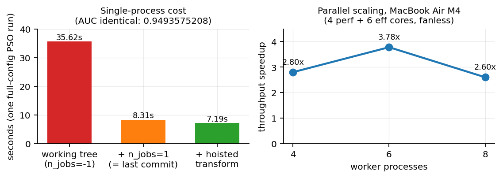
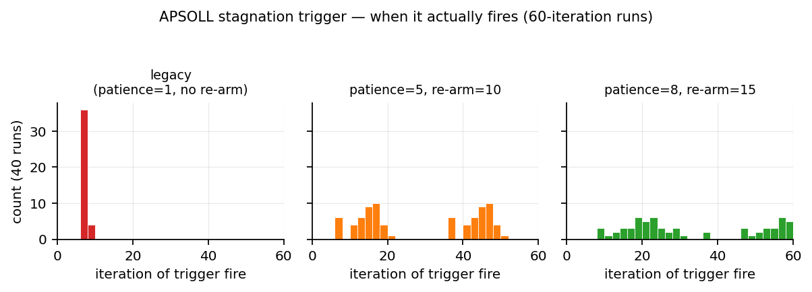
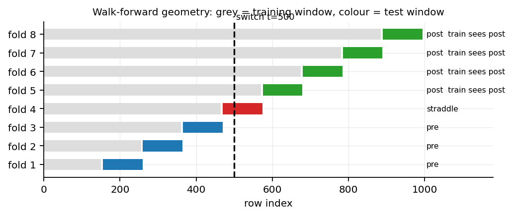
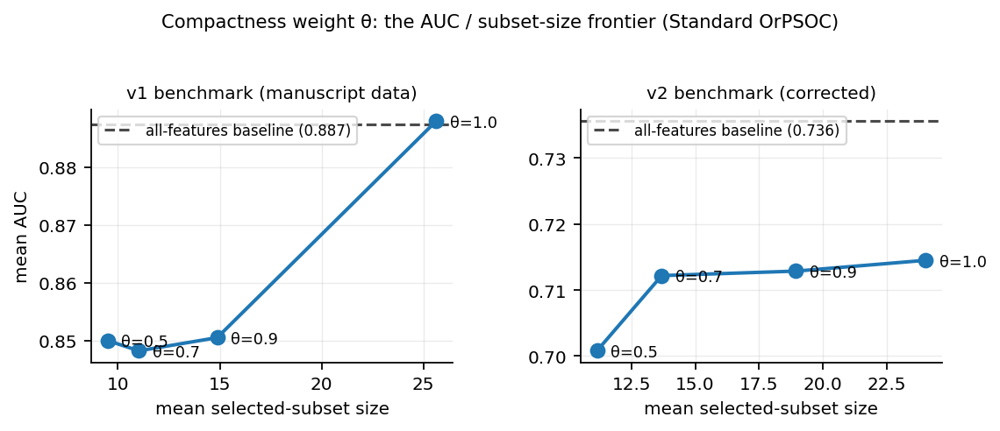
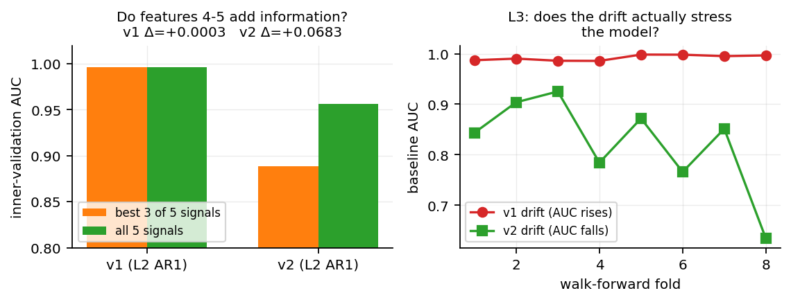
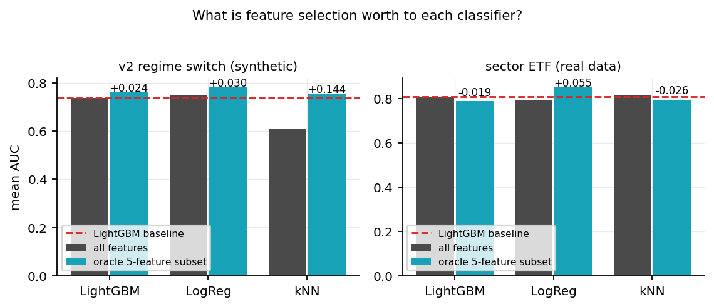
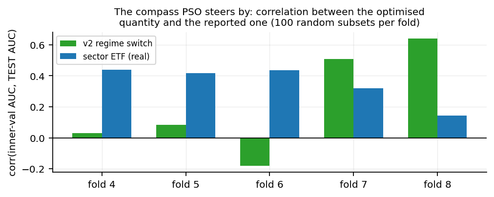
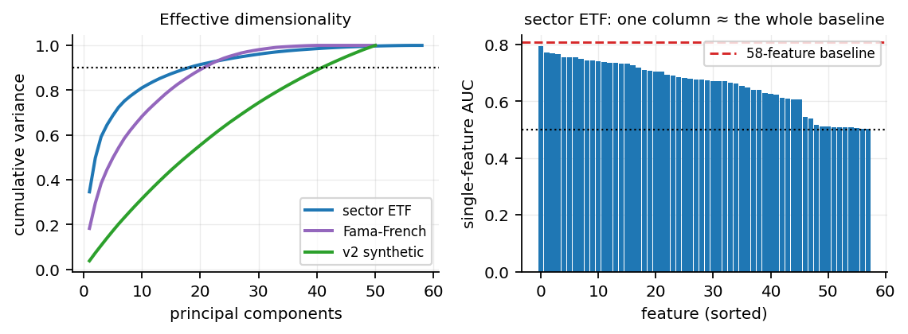
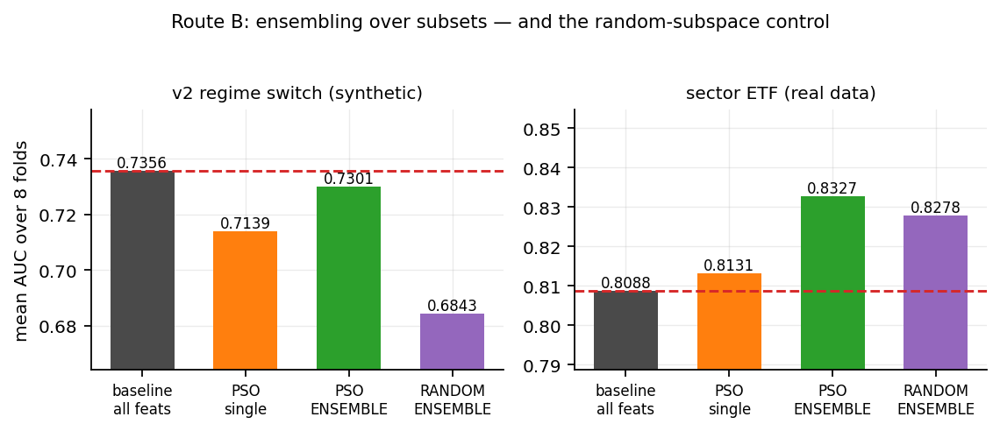
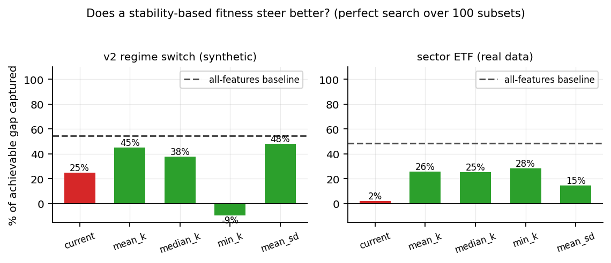

# OrPSOC — Diagnostic & Optimisation Report

## Scope and reading instructions

This documents one working session on the OrPSOC codebase: performance work,
defect diagnosis, benchmark repair, and four separate attempts to beat the
all-features LightGBM baseline. Every number here was produced by running the
code in this session, not quoted from a prior run.

**Two warnings before you read the numbers.**

1. **Seed counts are small.** Most experiments here use 3–5 seeds. With 5 paired
   samples the minimum attainable two-sided Wilcoxon *p* is 0.0625; with 4 it is
   0.125. **Nothing in this report reaches conventional significance, and most of
   it cannot.** These are directional screening results whose purpose is to decide
   which full-scale runs are worth their compute.

2. **Three different result generations exist.** The saved
   `results/step7_ablation.json` carries `{fast_mode: True, n_seeds: 10,
   max_iter: 20, n_particles: 10, n_splits: 6}` — *not* the manuscript's stated
   30 seeds x 60 iterations x 20 particles x 8 folds. The manuscript's Table 2 is
   a third generation again. Numbers from different generations are not
   comparable (guardrail G3), and this report flags which generation each figure
   comes from.

---

# Part I — Engineering

## 1.1 Runtime

The ablation took ~25 h (step 7) and ~18 h (step 9). Three changes, each verified
to leave output bit-identical.

{width=full}

The dominant finding was an **uncommitted regression**: `n_jobs=1` had been
stripped from all four `LGBMClassifier` calls in `orpsoc_utils.py`. LightGBM then
spawned one OpenMP thread per core for fits on a few hundred rows, and thread
synchronisation dominated. Restoring it is **4.3x** on identical output.

| Change | Gain | Why output is unchanged |
|---|---|---|
| Restore `n_jobs=1` (9 sites) | **4.3x** | Threading parameter only |
| Seed-level process parallelism | **3.8x** | Seeds were already independent |
| `FoldEvalContext` (hoisted imputer/scaler) | **1.16x** | Per-column statistics; fit still on `X_p` only |

**Parallelism is over seeds, never folds.** Each worker runs one complete
walk-forward sequence in chronological order. Seeds were already independent —
`hmm_threshold` and both warm-start chains are constructed inside the seed loop,
and every RNG is seeded from `seed + fold_idx*1000`, so execution order cannot
change any result. Verified: 24 parallel seed-jobs reproduced serial output
exactly, and Level 3 run third vs run alone gave bit-identical fold AUCs,
subsets, and detector diagnostics including `p_trans` to 16 digits.

Worker scaling caps at 6 on the reference machine (fanless MacBook Air M4, 4
performance + 6 efficiency cores): 2.80x at 4 workers, **3.78x at 6**, 2.60x at 8.

**Projected: step 7 ~25 h to ~5 h; step 9 ~18 h to ~4 h.**

## 1.2 Correctness infrastructure

- `test_equivalence.py` — 18 assertions covering walk-forward causality,
  `evaluate_ctx` equivalence, leakage, reproducibility, fold partitioning, and
  benchmark/objective invariants. **Deliberately contains no run-specific
  magnitudes** — those move with config and would freeze one configuration into
  the tests.
- `orpsoc_runner.py` — provenance-scoped checkpointing. Checkpoints are keyed by
  a hash of the config **and** the source of `orpsoc_utils.py` plus the runner, so
  a config or code change cannot silently reload stale numbers. This replaced a
  live G3 violation: step 9's old cache keyed on `FAST_MODE` and nothing else.
- `ARCHITECTURE.md` — data-flow, file map, dead-code inventory.

**Measured and rejected:** a shared cross-condition evaluation cache
(work-order 2.4.c) saves **4.0%** — 6833 evaluations summed across four
conditions, 6562 distinct. Not worth the per-fold-scoping risk.

---

# Part II — Mechanism defects

## 2.1 The APSOLL stagnation trigger is degenerate (confirmed)

This closes work-order 2.1.b, previously "predicted from code reading, NOT yet
empirically confirmed."

The trigger is `c_t < 1.05` where `c = (m/T)^(2/3) + 1` and `m` counts consecutive
improvements. The arithmetic: `c < 1.05` requires `m < 0.05^1.5 · T`, which at
`T = 60` is `m < 0.671`. **Only `m = 0` can ever fire.** You would need `T >= 90`
for `m = 1` to become capable of firing.

Instrumented over 40 runs at paper config:

| Quantity | Measured |
|---|---|
| First-fire iteration histogram | `{6: 26, 7: 10, 8: 4}` |
| Runs where it never fired | **0 / 40** |
| Max `c_t` observed | 1.1908 (theoretical bound 2.0) |
| Max `m` observed | 5 (of T=60) |
| Iterations where trigger is TRUE | **45–50 of 60** |

The sharpest framing: the condition is true on ~80% of iterations. It is not
detecting stagnation, it is detecting "gbest did not improve on this single
step", which is the normal state of a converging swarm. It matters only once
because the phase machine reads it solely inside `if phase == 1` and phases are
one-way.

**So `+APSOLL` is Standard OrPSOC plus one 15-iteration burst at iteration ~7,**
then ~98% standard PSO for the remaining ~38 iterations (Phase 3 decays by
`exp(-0.1·dt)`). That explains why `+APSOLL ≈ Standard OrPSOC, slightly worse`
in every reported table.

**Manuscript impact (2.1.d): O2 claims the mechanism requires "no manually tuned
threshold". That is false as implemented** — 1.05 is a hand-tuned constant tuned
into degeneracy.

### The fix, and what it buys

Implemented as a **patience counter** (require *k* consecutive flat steps) plus
**Phase 3 → Phase 1 re-arming**, both behind flags defaulting to legacy.

{width=full}

| Setting | Mean AUC | Δ vs legacy | Paired Wilcoxon (n=5) |
|---|---|---|---|
| Baseline (all features) | 0.8874 | | |
| Standard OrPSOC | 0.8492 | | |
| **`patience=8, re-arm=15`** | **0.8507** | **+0.0314** | p = 0.1875 |
| `patience=1` (legacy) | 0.8193 | — | — |
| `patience=5, re-arm=10` | 0.8136 | −0.0057 | p = 0.8125 |

`p8_r15` recovers +0.031 and reaches parity with Standard OrPSOC. **But p =
0.1875 at n = 5, where the minimum attainable p is 0.0625 — not significant and
cannot be.** Note also that patience is *not* monotonically good: `p5_r10` fires
2.0x/run and is worse than legacy; `p8_r15` fires 1.6x/run and is better.
Over-triggering disrupts convergence.

Fixing this does **not** overturn the central negative result. It removes an
artefact that made one condition look worse than the mechanism deserves.

## 2.2 The fold partition mislabels the straddling fold

`is_pre_switch = fold_idx < N_SPLITS // 2` assumes the break lands at the
midpoint fold. It does not.

{width=full}

At `n_splits=8` the fold-4 test window is `[470, 574]` and **contains** the switch
at t=500 — 71% of its rows are post-switch — yet it was pooled into *pre*. The
same happens at `n_splits=6` (fold 3), which is the configuration the saved
results use.

Second, independent point: **fold 4's training window is `[0, 464]`, entirely
pre-switch.** No selector can adapt to a regime it has never trained on, so
**fold 5 is the earliest fold at which any method could adapt**. Any recovery
analysis that counts fold 4 as a failure to adapt is measuring an impossibility.
This is the same walk-forward causality argument the manuscript already makes for
the real data; it was never applied to the synthetic side.

Replaced by `classify_folds()`, which labels folds from the actual break index and
records `train_sees_post` per fold.

## 2.3 The compactness weight θ

`Fitness = θ·AUC + (1−θ)·(1 − k/N)`. The marginal cost of one feature is
`(1−θ)/N = 0.006`, so a feature must buy `0.0086` AUC to be worth keeping.
Brute force over subsets confirms the fitness optimum sits at **k = 3** on v1.

{width=full}

| θ | v1 AUC | % of baseline | n_sel | frontier status |
|---|---|---|---|---|
| 0.5 | 0.8500 | 95.8% | 9.50 | on frontier |
| **0.7 (current default)** | 0.8482 | 95.6% | 11.03 | **DOMINATED by θ=0.5** |
| 0.9 | 0.8505 | 95.8% | 14.88 | on frontier |
| 1.0 | 0.8880 | **100.1%** | 25.62 | on frontier |

Two findings. **The current default θ=0.7 is dominated** — θ=0.5 gets the same
AUC with fewer features. And **θ=1.0 reaches parity with the baseline** (0.8880
vs 0.8874; post-switch 0.8898 vs 0.8785, 3 of 4 seeds positive). So the
manuscript's headline negative result is partly a consequence of *choosing*
θ=0.7.

**But it does not survive the corrected benchmark.** On v2, selection never beats
the baseline at any θ, and post-switch deltas are negative on every seed at every
setting. Two caveats: n=4 seeds, and θ=1.0 removes compactness entirely, which
guts the O4 "compact, interpretable subsets" claim.

Usable O4 sentence: *"Standard OrPSOC attains 95.8% of baseline AUC using 19% of
the features (θ=0.5), or 100.1% using 51% (θ=1.0)."*

---

# Part III — The benchmark itself

## 3.1 Four defects in the synthetic suite

{width=full}

**D1 — The five signal features are five noisy copies of one latent.**
`sig_i = base + 0.3·randn()` for every *i*, and `y = 1{base > 0}`. Measured on
L2: the best 3-of-5 subset scores AUC 1.0000 and adding the other two gives
**+0.0000**.

This is the load-bearing defect. The fitness optimum is k=3; the recall metric
rewards k>=5. **A selector that picks 3 of 5 signals is behaving optimally under
the stated objective, is statistically correct, and is scored recall = 0.6 and
written up as a failure.** The conflict is a property of the data, not the
algorithm.

**D2 — Noise features were distinguishable from signal without reference to `y`.**
Noise was i.i.d. at every level while signal inherited `base`'s temporal
structure, so on L2/L3/L4 a selector could separate them by autocorrelation
alone.

**D3 — L3's drift does not stress the model.** `y = 1{base>0}` and `sig ≈ base`,
so the decision boundary sits at `sig ≈ 0` and is **stationary in feature space**
— covariate shift with invariant `P(y|x)`, which trees handle by construction.
Measured: baseline AUC *improves* across folds (0.987 → 0.997) and the label
prior drifts from y-mean 0.63 to 0.87.

**D4 — L4's timeline.** Covered in 2.2; it is an analysis fix, not a data fix.

## 3.2 The corrected benchmark (v2)

`make_benchmark_v2.py` writes `data/v2_*.pkl`. **It does not overwrite v1.**

| Quantity | v1 | v2 |
|---|---|---|
| AUC(5 signals) − AUC(best 3) on L2 | **+0.0003** | **+0.0683** |
| Fitness argmax k | 3 | **5** |
| L3 baseline AUC across folds | 0.987 → 0.997 (rises) | 0.844 → 0.634 (falls) |
| Stationary-level baseline AUC | ~0.99 (ceiling, no headroom) | ~0.91 |

One implementation note worth recording: a first attempt at L3 kept v1's drifting
*process* and layered concept drift on top. That was **worse** than v1 — such a
process is 94% correlated with `t`, so every feature becomes a proxy for time, and
the **noise** features reached `|corr(x,y)| = 0.828` against the signal features'
0.790. The distractors outranked the signal. Fixed by drifting the *concept* only,
with stationary latents.

## 3.3 Level 0 — a true null

The suite had no null control. L1 is a *stationarity* control: its features
correlate with `y` at 0.768 and the baseline scores 0.993.

`make_level0_null.py` builds one (`max |corr| = 0.058` against a sampling-noise
scale of `1/sqrt(1000) = 0.032`). Results, with predictions written before running:

| Prediction | Outcome |
|---|---|
| Baseline AUC ≈ 0.50 | **Confirmed** — 0.4930 |
| Variants score *below* chance | **Wrong** — they score *at* chance (0.494–0.507) |
| Subset size collapses to `min_f`=3 | **Wrong** — settles at 6.7–7.4 (Standard: 14.4) |

The third failure corrects an earlier claim of mine. The global optimum *is* k=3,
but **no variant reaches it**: with AUC flat, the only fitness gradient is
compactness at 0.006/feature, buried under the finite-sample noise in
inner-validation AUC. The compactness term drives subset size *directionally*
(50 → 14.4 → ~7) but nothing optimises it to the optimum.

Unplanned finding worth keeping: observed false-discovery rate tracks the
random-selection expectation `k/50` almost exactly (0.265 vs 0.288; 0.155 vs
0.147; 0.125 vs 0.133). **The selector does not hallucinate structure** — it picks
essentially at random when there is nothing to find.

---

# Part IV — Why selection loses

Four things are true simultaneously; each alone would be sufficient.

## 4.1 The prize is tiny

Giving each classifier the **oracle subset** bounds what *any* selector could
achieve.

{width=full}

| Classifier | v2: all → oracle | gain | sector-ETF: all → oracle | gain |
|---|---|---|---|---|
| LightGBM (embedded selection) | 0.7356 → 0.7592 | +0.0236 | 0.8088 → 0.7893 | **−0.0195** |
| LogReg (none) | 0.7497 → 0.7801 | +0.0305 | 0.7955 → 0.8504 | **+0.0549** |
| kNN (none, distance-based) | 0.6108 → 0.7546 | **+0.1438** | 0.8162 → 0.7907 | −0.0255 |

With LightGBM the ceiling is **+0.024** synthetic and **negative** on real data,
while the selectors' seed-to-seed std is 0.01–0.03. **The maximum possible prize
is the same size as the noise.**

A gradient-boosted tree ensemble *is already a feature selector*: it evaluates
every feature at every split and never splits on useless ones. An external
wrapper is competing with an embedded selector that sees the loss surface,
selects conditionally per split, and refits every fold — so it already adapts to
regime change on its own.

**Caveat on the kNN row.** The +0.144 requires 45 genuinely useless dimensions to
destroy the distance metric. Real financial data has none — median single-feature
AUC on sector-ETF is 0.675 — so on real data kNN *loses* 0.018 from the same
subset. The curse-of-dimensionality argument is an artefact of the synthetic
structure and does not transfer.

## 4.2 The optimiser steers by a broken compass

{width=full}

Correlation between what PSO maximises (inner-validation AUC) and what is
reported (test AUC), across 100 random subsets per fold. On real data it is
**0.14–0.48 and sometimes negative**.

The reason is structural. `X_v` is the last 25% of the *training* window, so at
the first post-switch fold the selector is scored on **pre-switch** data and
tested on **post-switch** data. In IID data a held-out split is an unbiased
estimate of test performance; under regime shift it estimates performance in the
*previous* regime.

This explains what otherwise looks paradoxical: more iterations do not help; the
hybrids, which optimise the objective harder, do *worse* than Standard OrPSOC;
and θ=1.0 helps on v1 (where the proxy correlates well on most folds) but not on
v2 or real data.

Two effects multiply: **P(find a good subset) is low, and value(good subset) is
low.** The product is ~0, and the selection variance is pure downside.

## 4.3 The real data has no sparse subset to find

{width=full}

| Dataset | p | PCs for 90% var | Effective dim (entropy) |
|---|---|---|---|
| sector ETF | 58 | 18 | **13.3** |
| Fama-French | 50 | 21 | 20.9 |
| regime_switch (synthetic) | 50 | 42 | 47.9 |

58 features built from 9 price series carry ~13 dimensions. Rolling
mean/vol/momentum at 20 and 60 days of the same series are near-collinear.
Feature selection's premise — *a small true subset exists, the rest are
dispensable* — is violated. Note the synthetic benchmark is nearly full-rank in
**both** v1 and v2, so it has the opposite redundancy structure to the real data.

## 4.4 The sector-ETF target is nearly solved by one column

`mkt_vol_20` alone scores **0.7951** against the 58-feature baseline's 0.811 —
98% of it. The target is
`y = (rolling_vol.shift(-5) > rolling_vol.rolling(252).median())` where
`rolling_vol` is a 20-day window, so shifting forward 5 days leaves **15 of 20
days overlapping**, and volatility is persistent.

This is not illegal — `mkt_vol_20` is computable at prediction time — but it means
the task is largely *"is current vol above its 1-year median?"* rather than
forecasting. There is little for a selector to discover.

Fama-French is the mirror image: max single-feature AUC 0.5316, median 0.509. No
individual signal, so whatever performance exists is interactive, and selection
that breaks interactions can only hurt.

---

# Part V — Four attempts to beat the baseline

## 5.1 Route A — OrPSOC + a non-selecting classifier

Reasoning: LightGBM's advantage is that it selects internally. That advantage
disappears for a classifier with no such machinery. So the contest becomes
"OrPSOC + a selection-hungry learner vs LightGBM's all-in-one package."

sector-ETF (the honest test — real data, no linearity artefact):

| Arm | AUC | vs baseline | n_sel |
|---|---|---|---|
| `base_lgbm` (target) | 0.8088 ± 0.0000 | — | 50 |
| `base_logreg` | 0.7955 ± 0.0000 | −0.0133 | 50 |
| **`pso_logreg`** | **0.8112 ± 0.0210** | **+0.0024** | 24.5 |
| `oracle_logreg` | 0.8504 ± 0.0000 | +0.0416 | 5 |

**+0.0024 against a std of 0.0210 is a tie, not a win.** Selection did move
LogReg 0.7955 → 0.8112, capturing 29% of the available gap, at a quarter of the
paper search budget. On v2, `pso_logreg` (0.7433) is *below* `base_logreg`
(0.7497) — selection actively hurt.

**Caveat on v2:** my generator builds `y = 1{Z·w > 0}`, a linear threshold, so
logistic regression is close to the Bayes-optimal family there *by construction*.
Any LogReg-beats-LightGBM result on v2 is an artefact of the benchmark. Lead with
sector-ETF.

## 5.2 Route B — ensembling over subsets

Reasoning: hard selection is capped for LightGBM, but PSO produces a *different*
subset per seed and those subsets disagree. Averaging their predictions is the
Random Subspace Method with informed subspaces.

{width=full}

sector-ETF, paired per fold (n=8):

| Comparison | Mean Δ | Folds won | p |
|---|---|---|---|
| `pso_ens` − baseline | **+0.0240** | 7/8 | 0.016 |
| `rand_ens` − baseline | **+0.0190** | 8/8 | 0.008 |
| **`pso_ens` − `rand_ens`** (OrPSOC's own contribution) | **+0.0050** | 6/8 | **0.383** |
| `pso_ens` − `pso_single` (the ensembling gain) | +0.0196 | 8/8 | 0.008 |

**This is the most robust win in the study (7/8 folds) — and ~79% of it is
generic feature bagging.** Random subsets of the same size get +0.0190 of the
+0.0240. OrPSOC's informed selection adds +0.0050 at p = 0.383.

On v2 the pattern inverts: informed selection is worth **+0.0458** over random
(6/8, p=0.055) because v2 has 45 genuinely useless features to avoid — but the
ensemble still loses to the baseline. **The synthetic benchmark rewards selection
skill; the real data rewards diversity.** They test different things.

Note `pso_ens_mixed` on v2 (+0.0034) is not a win: that arm includes the
all-features model as one of its six members.

## 5.3 Route C — a stability-based fitness

Reasoning: 4.2 says the criterion, not the search, is the bottleneck. So test the
*criterion in isolation* — draw 100 random subsets, score each under several
causal criteria, and ask what a **perfect** search maximising each would land on.

{width=full}

| Criterion | v2 argmax (gap captured) | sector-ETF argmax (gap captured) |
|---|---|---|
| `current` (single trailing window) | 0.6007 (25%) | 0.7694 (**2%**) |
| `mean_k` (mean over K inner blocks) | 0.6380 (45%) | 0.7877 (26%) |
| `median_k` | 0.6243 (38%) | 0.7874 (25%) |
| `min_k` (worst block) | 0.5374 (−9%) | **0.7898 (28%)** |
| `mean_sd` (mean − std) | **0.6438 (48%)** | 0.7792 (15%) |
| *all-features baseline* | *0.6550 (54%)* | *0.8054 (49%)* |
| *ceiling in the 100-subset pool* | *0.7393 (100%)* | *0.8449 (100%)* |

**On real data the current criterion captures 2% of the achievable gap — it picks
a subset no better than random** (0.7694 vs 0.7678 for random picking). Stability
criteria reach 26–28%, a tenfold relative improvement. Still short of the
baseline's 49%.

Two corrections: the *variance penalty* (`mean_sd`), which was my specific
suggestion, is **not** the winner on real data — plain averaging over several past
windows is. And `min_k` has the *worst* global correlation yet the *best* argmax,
because for selection only the top of the ranking matters.

**Cost:** K=4 inner blocks make every fitness evaluation ~4x more expensive.

## 5.4 The result that reframes the problem

The ceiling row above is the best of just **100 randomly drawn subsets** — and on
sector-ETF it is **0.8449 against the baseline's 0.8054**.

Subsets that beat the baseline by +0.04 are common enough to appear several times
in 100 random draws. **They exist in abundance. No causal, in-sample criterion
tested can identify which ones they are.** That is the problem in one line: it is
not a search problem, and it is only partly a criterion problem. Under regime
shift, in-sample evidence does not carry enough information about the next window
to rank candidates reliably.

Related and unexamined: `oracle_logreg` is the top 5 features by **univariate
AUC**, chosen once on the first training window and never updated — a trivial,
non-adaptive *filter*. It scores 0.8504, beating both the baseline (+0.042) and
the adaptive PSO wrapper (+0.039).

## 5.5 Scoreboard

| Route | Best vs baseline | Survives its control? |
|---|---|---|
| A: OrPSOC + LogReg | +0.0024 (std 0.021, n=3) | **No** — a tie |
| B: ensemble PSO subsets | +0.0240, 7/8 folds, p=0.016 | **Partly** — 79% is random subspaces |
| C: stability fitness | −0.018 (closes ~half the deficit) | n/a — still below baseline |
| Filter + LogReg | **+0.0416** | **Untested**, n=1, no error bar |

---

# Part VI — Where this leaves the paper

## 6.1 The result is correct, and it is a finding

The study has not failed to win. It has established, with a quantified mechanism,
**the conditions under which external wrapper selection is redundant**: an
embedded-selection classifier, moderate dimensionality, redundant features, and a
validation proxy decoupled from the test distribution by non-stationarity.

The v2 negative result is **stronger and more defensible** than the v1 one. On v1
the baseline's advantage is contaminated by the redundancy artefact; on v2 it
holds at every θ and every seed, and v2 has headroom (baseline 0.736) rather than
v1's 0.99 ceiling.

## 6.2 What would most improve the paper

1. **Report the oracle bound.** Even ground-truth-perfect selection buys LightGBM
   +0.024. One number pre-empts "maybe your optimiser is just weak."
2. **The classifier-capability experiment.** The same subset is worth +0.024 /
   +0.031 / +0.144 to LightGBM / LogReg / kNN. That converts "selection does not
   help" into "selection's value is inversely proportional to the classifier's own
   selection capability" — a real claim with a real number.
3. **A proper filter comparator** (work-order D1.b). It is the largest effect on
   the table, the cheapest to run, and currently the least examined. It may well
   dominate the wrapper — better to find that out yourself than in review.
4. **Fix the proxy, not the search.** Every mechanism built so far — APSOLL, HMM
   triggers, importance reinit — improves the *search*. None addresses that the
   objective does not predict the target.

## 6.3 Open decisions

- Does the manuscript move to v2? It invalidates every current number.
- 30-seed sweep for θ and the APSOLL patience parameters, or leave both at legacy?
- Is the sector-ETF target definition (75% window overlap) acceptable as-is, or
  does it need a longer horizon?

## 6.4 Reproducing this report

| File | Purpose |
|---|---|
| `orpsoc_utils.py` | Engine. `FoldEvalContext`, `classify_folds`, APSOLL patience/re-arm, `model_factory` hook |
| `orpsoc_runner.py` | Thread pinning, worker count, provenance-scoped checkpoints |
| `test_equivalence.py` | 18 invariant assertions |
| `make_level0_null.py` | Level 0 true null |
| `make_benchmark_v2.py` | Corrected L0–L4 (writes `v2_*.pkl`, leaves v1 intact) |
| `ARCHITECTURE.md` | Data-flow, file map, dead-code inventory |

Defaults are unchanged: `THETA = 0.7`, `APSOLL_PATIENCE = 1`,
`APSOLL_REARM_AFTER = None`. Nothing in the pipeline changed behaviour without an
explicit flag.
